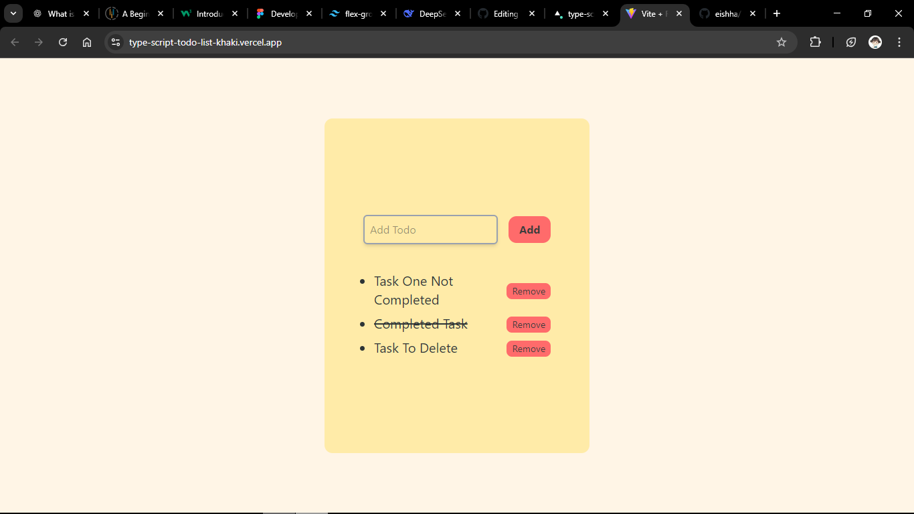

# [Basic To-do App]  

🔗 **Live Demo**: https://type-script-todo-list-khaki.vercel.app/  
📂 **Code**: [https://github.com/eishha/TypeScript-Todo-List]  

 

## 🚀 Features  
- Feature 1 ("Add and delete todos").  
- Feature 2 ( "Mark tasks as complete").
- Feature 3 ( "Unmark the marked tasks"). 
- Feature 4 ( "Can Remove/Delete tasks").  

## 🛠️ Tech Stack  
- **Frontend**: React, TypeScript, Tailwind CSS  
- **Deployment**: Vercel  

## 📦 Installation  
1. Clone the repo:  
```bash  
git clone [https://github.com/eishha/TypeScript-Todo-List]  

